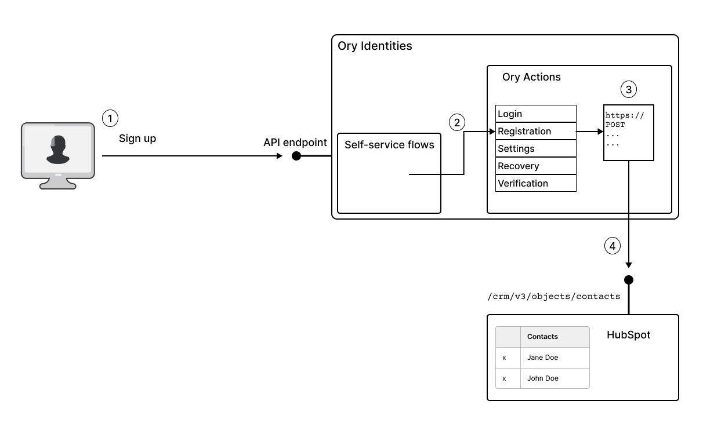
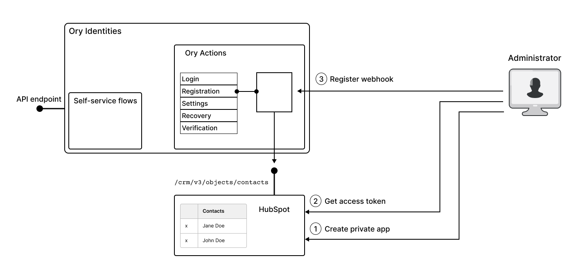

# Use case: Integrate Ory Actions with the HubSpot CRM platform

[HubSpot](https://www.hubspot.com/) is a CRM platform that can be used to manage and integrate data from marketing, sales, content management, and customer service.
The HubSpot platform also offers an extensive API, which can be used for developing integrations.
In combination with Ory Actions, this makes it possible to integrate any of the Ory self-service flows with HubSpot.
In particular, you can integrate HubSpot with the Ory Network registration flow, so that new contacts are automatically created in the HubSpot contacts list whenever users register with an Ory Network project.

The advantage of integrating Ory Network with HubSpot is that users signing up with the Ory Network project automatically become available to the CRM platform, facilitating lead generation and marketing campaigns (provided that users give the appropriate consents).

## How Ory integrates with HubSpot

The following diagram illustrates how Ory integrates with HubSpot.
In this example, we consider the case where the registration flow in Ory triggers an API call to HubSpot, automatically creating a new contact in HubSpot.
In other words, a new record is created simultaneously in the Ory Identities database and in the HubSpot contacts list. 

In this example, the API call to HubSpot is triggered as follows:

1. The end user signs up to a new account using Ory Identities, completing the registration self-service flow.
2. Upon completion, the registration flow triggers any actions registered under the `flows.registration.after.hooks` section of Ory Identities configuration.
3. The hook for the HubSpot CRM platform, registered under `flows.registration.after.hooks`, is now triggered, and Ory evaluates the Jsonnet template to construct the body of the API call.
4. The Ory action invokes the `/com/v3/objects/contacts` HubSpot API endpoint to create a new contact in HubSpot.

## Creating a HubSpot webhook

To enable the registration flow described above, a system administrator must first set up the integration with HubSpot.

In outline, the main steps for setting up the integration are, as follows:

1. The system administrator goes to the settings in the HubSpot dashboard and creates a new private app for this integration.
   For details of how to create a private app in HubSpot, see the [Private apps](https://developers.hubspot.com/docs/api/private-apps#make-api-calls-with-your-app-s-access-token) page in the HubSpot documentation.

2. The system administrator copies the access token from the new private app.

3. Using the access key from the previous step, the system administrator creates and registers an Ory Action for triggering a HubSpot API call whenever a user completes the registration flow.
   See [HubSpot integration with Ory Actions](https://www.ory.sh/docs/actions/integrations/hubspot) in the Ory documentation.
