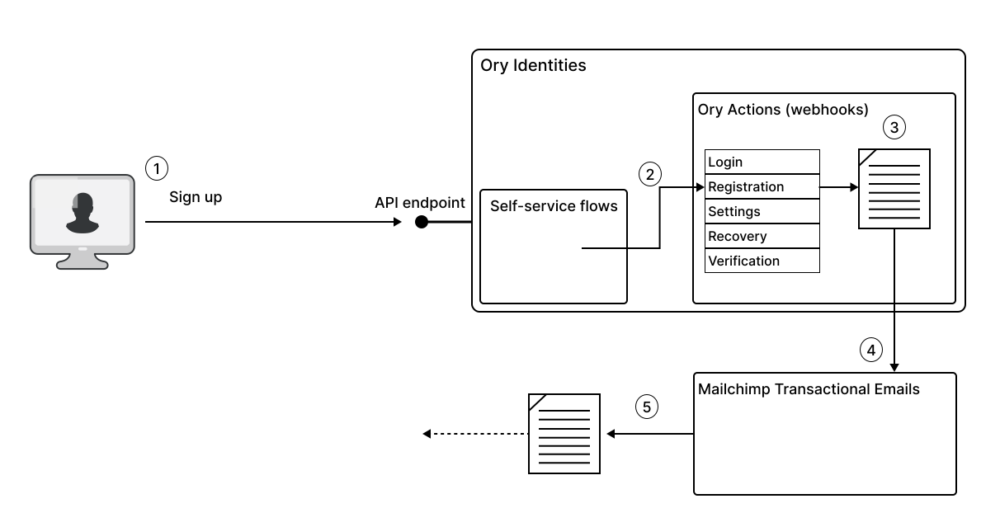
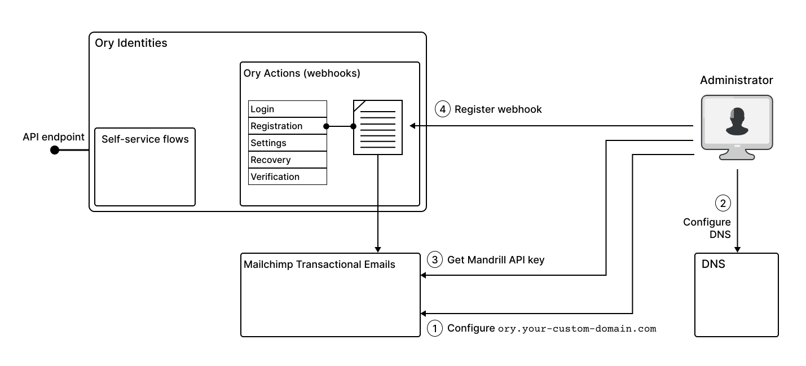

# Use case: Integrate Ory Actions with the Mailchimp Transactional Email system

[Mailchimp](https://www.mailchimp.com/) is an email marketing platform that provides tools and services to help businesses send marketing emails, newsletters, and automated campaigns to their customers.
It allows you to create, manage, and send emails to your subscribers, as well as segment and target specific groups of subscribers based on their interests and behaviors.

There are two main subsystems of Mailchimp that are of interest:

- **Mailchimp email campaign tools** &mdash; available from the main Mailchimp dashboard, the campaign tools enable you to organize and manage mass mailings to specific audiences (subscriber lists).
- **Mailchimp Transactional Email** &mdash; available from the [Mandrill app](https://mandrillapp.com/) dashboard, Mailchimp transactional email is a paid optional add-on for Mailchimp for managing transactional emails, which are user-specific emails sent to one user at a time.

In fact, it is the transactional email subsystem that is most relevant to the Ory integration use case.
A transactional email is an automated email message sent to an individual user, in response to some event or interaction with your application.
For example, when a user signs up to your website for the first time, this might trigger a welcome email to be sent to their email address.
This is where the integration with Ory comes in.
You can configure Ory Actions to trigger transactional emails in response any event that occurs in a self-service flow (for example, login, registration, or account validation).

The advantage of integrating Ory with the Mailchimp Transactional Email system is that Mailchimp sends these emails on your behalf and is able to track all of the transactional emails that pass through the system.
You can use the Mandrill dashboard to track all of the inbound and outbound transactional emails and generate reports and analytics for this email traffic.

## How Ory integrates with Mailchimp

The following diagram illustrates how Ory integrates with the Mailchimp Transactional Email system.
In this particular example, we consider the case where a transactional email is triggered immediately after a user signs up (where Ory Identities is used to manage the sign-up flow).

In this example, the transactional email is triggered as follows:

1. The end user signs up to a new account, completing the registration self-service flow.
2. Upon completion, the registration flow triggers any actions registered under the `flows.registration.after.hooks` section of Ory Identities configuration.
3. The hook for Mailchimp Transactional Email, registered under `flows.registration.after.hooks` is now triggered, and Ory evaluates the Jsonnet email template, personalizing the content with the user's name and email address.
4. The Ory action forwards the content of the email to Mailchimp by invoking an API endpoint on the Mailchimp Transactional Email system.
5. Mailchimp imports the email into its email system and then sends the transactional email to the end user on behalf of your email domain.

:::info

If you plan to send a transactional email that includes the header `From: info@{your-domain}.com`, you need to configure Mailchimp so that it has the authority to send (and receive) emails for the `{your-domain}.com` email domain.

:::

## Enabling webhooks for integration with Mailchimp

To enable the registration flow described above, a system administrator must first set up the integration with Mailchimp Transactional Emails.

In outline, the main steps for setting up the integration are, as follows:

1. The system administrator goes to the Mailchimp Transactional Email dashboard and adds your domain, `{your-domain}.com`, as a sending domain.
   See [Add a sending domain](https://mailchimp.com/developer/transactional/guides/send-first-email/#add-a-sending-domain) in the Mailchimp developer documentation.
2. Next, the system administrator configures your DNS record, so that Mailchimp can act as a trusted email server in your domain.
   See [Configure your DNS](https://mailchimp.com/developer/transactional/guides/send-first-email/#configure-your-dns) in the Mailchimp developer documentation.
3. The system administrator generates a Mandrill API key to authorize Ory to access the Mandrill API, enabling the system to forward transactional emails to Mailchimp.

   :::note

   Mandrill and Mailchimp are separate applications that have their own API keys. You can't use the Mailchimp API key to interact with Mandrill APIs. 
   To generate a Mandrill API key go to the [Settings](https://mandrillapp.com/settings) page on the Mailchimp Transactional Email system dashboard.

   :::

4. Using the API key from the previous step, the system administrator creates and registers an Ory Action for triggering a transactional email whenever a user completes the registration flow.
   See [Mailchimp integration with Ory Actions](https://www.ory.sh/docs/actions/integrations/mailchimp) in the Ory documentation.

